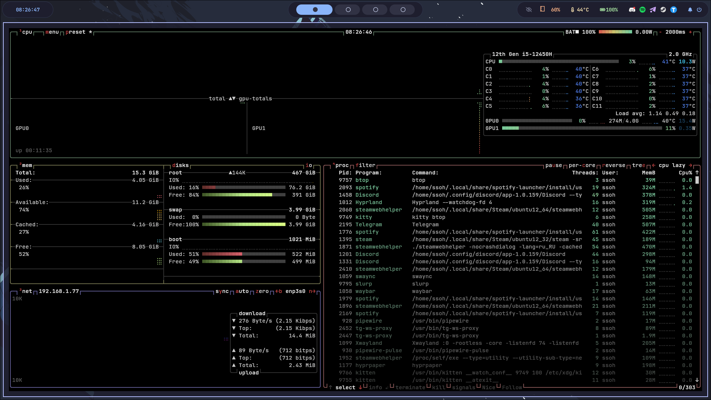
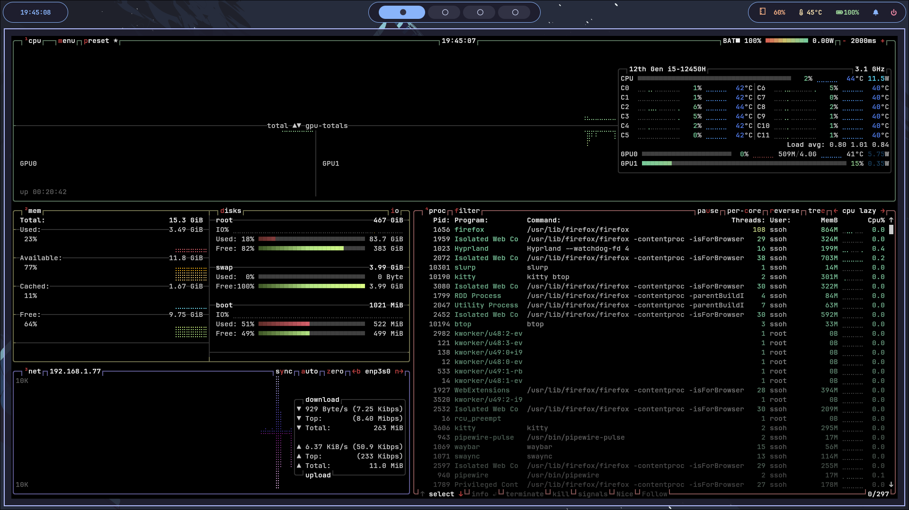
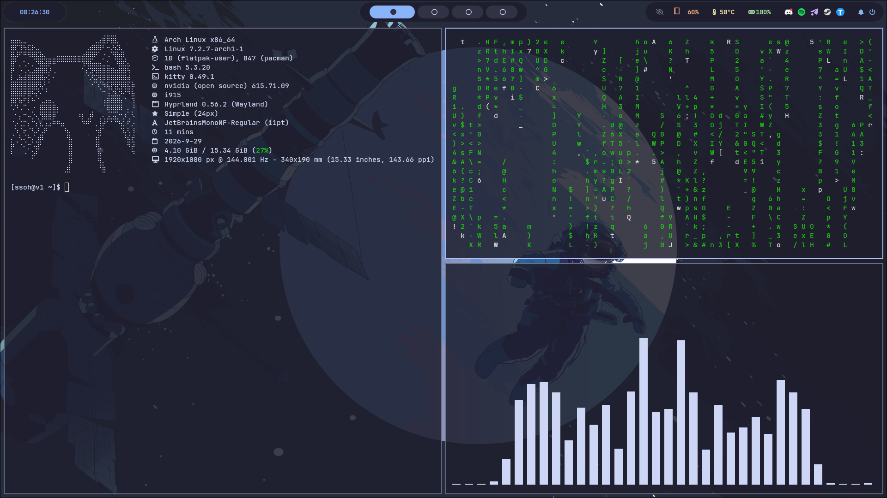

# Minimalist

Минималистичное окружение на базе Hyprland для Arch Linux, оптимизированное для игр.

## Компоненты

*   **Arch Linux** — дистрибутив
*   **Hyprland** — оконный менеджер
*   **Waybar** — панель
*   **Rofi** — лаунчер
*   **Kitty** — терминал
*   **SwayNC** — уведомления
*   **SDDM** — экран входа (тема ii-sddm-theme)
*   **PipeWire** — звук
*   **Fastfetch** — информация о системе

## 📸 Скриншоты

### Рабочий стол


### Терминал с Cava


### Мониторинг системы (btop)


## 📋 Требования

*   **Arch Linux** (или производные: CachyOS, EndeavourOS, Manjaro)
*   **AUR-помощник** (`yay` или `paru`) — скрипт установит `yay` автоматически, если его нет
*   **Интернет** — для загрузки пакетов и AUR
*   **Свободное место** — минимум 5 ГБ

---

## 💻 Рекомендуемые характеристики

### 🟢 Полная версия (Full)

*   **Процессор:** Intel Core i5 (10-го поколения или новее) / AMD Ryzen 5 (3000-й серии или новее)
*   **Оперативная память:** 8 ГБ и больше
*   **Видеокарта:** NVIDIA GTX 1050 / AMD RX 560 / Intel Iris Xe или новее
*   **Накопитель:** SSD (NVMe рекомендуется)
*   **Разрешение экрана:** 1920×1080 или выше

**Что входит:**
*   Плавные анимации окон и рабочих столов
*   Плавное появление/исчезновение окон
*   Анимация переключения рабочих столов

---

### 🟡 Облегчённая версия (Lite)

*   **Процессор:** Intel Core i3 (8-го поколения или новее) / AMD Ryzen 3 (2000-й серии или новее)
*   **Оперативная память:** 4 ГБ и больше
*   **Видеокарта:** Intel HD Graphics 620 / NVIDIA GT 1030 / AMD Vega 8 или новее
*   **Накопитель:** SSD (SATA достаточно)
*   **Разрешение экрана:** 1366×768 или выше

**Что входит:**
*   Без анимаций (мгновенные переходы)
*   Минимальная нагрузка на GPU/CPU
*   Быстрый отклик интерфейса

---

### ⚠️ Важно

*   **На слабых ПК (2 ГБ RAM, HDD)** окружение может работать нестабильно — рекомендуется использовать лёгкие оконные менеджеры (i3, Openbox).
*   **На NVIDIA** могут потребоваться дополнительные настройки (см. [документацию Hyprland](https://wiki.hyprland.org/Nvidia/)).

## ⌨️ Бинды

Полный список биндов смотри в [docs/KEYBINDS.md](docs/KEYBINDS.md).

**Быстрый доступ:** нажми `SUPER + /` — откроется окно с биндами.

## Установка

```bash
git clone https://github.com/ssOh-v1/Minimalist.git
cd Minimalist
./install.sh
